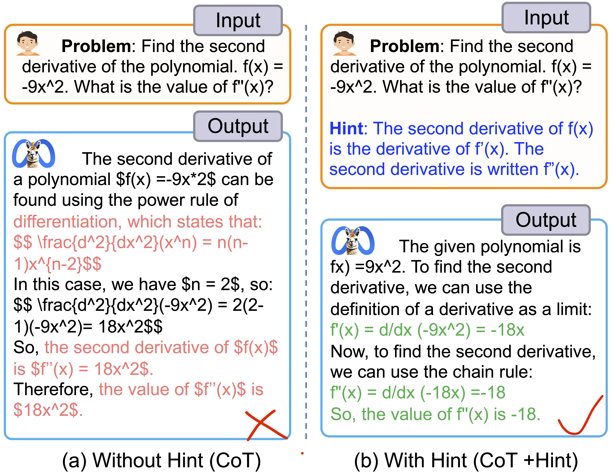

# Hint-before-Solving Prompting (HSP)
This is the Source Code of Paper: [Hint-before-Solving Prompting: Guiding LLMs to
Effectively Utilize Encoded Knowledge](https://arxiv.org/).


## 1. What is Hint-before-Solving Prompting (HSP)?

(1) Introducing hints can assist LLMs in generating accurate and logical reasoning. As illustrated in the figure below, introducing hints enabled Llama2-70B to reason correctly and obtain the correct answer.

<div align=center>

</div>

(2) However, providing helpful hints for each test sample is impractical. Can Large Language Models (LLMs) generate useful hints by themselves?
To mitigate this problem, we introduced Hint-before-Solving Prompting (HSP), which guides the model to generate hints (e.g., specific knowledge or key ideas)  for solving the problem and then generate solutions containing intermediate reasoning steps. 
Since HSP is orthogonal to prompting methods (e.g., Chain-of-Thought (CoT)), we applied HSP to CoT, Least-to-Most, Plan-and-Solve, and Standard promptings, as shown in the following figure.

<div align=center>

</div>

(3) How do the hints generated by LLMs impact reasoning?
The case analysis shown in the following figure shows that LLMs can effectively generate knowledge or key ideas to solve problems, achieving accurate and logical reasoning and obtaining the correct answers.

<div align=center>

</div>


## 2. Get started
We suggest using miniconda/conda to set up the environment based on Python 3.10. 
After creating your env, you'll need to install Pytorch, Transformers, and vllm.
```
conda activate your_env
pip install torch torchvision torchaudio
pip install transformers
pip install vllm

```

 

## 3. Repo Structure
- `data/`: Include six evaluation datasets. 
- `icl_robust/`: Demonstrated examples for robust analysis.
- `prompt/`:  Applying HSP to SD, LtM, PS, and CoT promptings for the LLMs to generate the reasoning process across six datasets.
- `sft/`:
  - `deepspeed_config.json`: We use deepspeed to accelerate model training.
  - `sft_data_*.jsonl`: Supervise fine-tuning datasets.
  - `sft_train.py`: The main train class.
  - `sft_train.sh`: Run this file to train model.  
- `evaluate.py`: Evaluation script for the six datasets.
- `inference.py`: LLMs inference script.
- `produce_hintV2.py`: The output is divided into two stages: the first generates a hint, and the second generates a solution.
- `produce_hintV2_gpt.py`: Use gpt4's hint to generate solution.
- `math/`: evaluation of Math datasets.
  - `data/`: Math datasets.
  - `prompt/`:  The prompts used in the experiment.
  -  `evaluate.py`: evaluation script.
  -  `produce.py`: inference script.


## 4. Usage

### (1) Inference

Run `inference.py`:

Example:
```
python inference.py --model {model_path} --tp_degree 4 --dataset_name GSM8K --output_path gsm8k_output.json --hint
```

### (2) Evaluation
Run `evaluate.py`

The accuracy will be printed to standard output.

Example:
```
python evaluate.py --dataset_name GSM8K --file gsm8k_output.json
```

### (3) Supervise Fine-tuning 
- SFT on HSPMATH dataset
- We constructed a HSPMATH1 dataset with 7.5k samples based on the GSM8K training dataset with the assistance of GPT-4.
- Based on rewriting questions from the MetaMathQA dataset, we expanded our HSPMATH dataset to 75,000 samples (./sft/sft_data_v2. jsonl).
- We conducted SFT training on 8xA100 (80G) GPUs using the Slurm scheduling system. The training script path is: ./sft/sft_train.sh
```
model_llemma_7b="EleutherAI/llemma_7b"
epoch_output_dir_llemma_7b="./ckpt/with_hint_epochs_llemma_7b"

srun  \
torchrun --nnodes 1 --nproc_per_node 8 \
--rdzv_id $RANDOM --rdzv_backend c10d --rdzv_endpoint $head_node_ip:29549 \
sft_gsm8k.py \
--deepspeed  "./deepspeed_config.json"  \
--model_name_or_path $model_llemma_7b \
--output_dir $epoch_output_dir_llemma_7b \
--model_max_length 1024 \
--per_device_train_batch_size 2 \
--gradient_accumulation_steps 4 \
--num_train_epochs 5 \
--data_path "sft_data_v2.jsonl" \
--need_hint True \
--bf16  \
--save_strategy epoch \
--learning_rate 2e-5 \
--warmup_ratio 0.03 \
--lr_scheduler_type "cosine" \
--logging_steps 50 \
--logging_dir "./logging_dir" \
--report_to="tensorboard" \
--gradient_checkpointing True \
--save_total_limit 10

```


## 5. Citation
If you find this repository useful, please cite our paper:
```
@article{,
  title={Hint-before-Solving Prompting: Guiding LLMs to Effectively Utilize Encoded Knowledge},
  author={Jinlan Fu, Shenzhen Huangfu, Hang Yan, See-Kiong Ng, Xipeng Qiu},
  journal={arXiv preprint},
  year={2024}
}
```